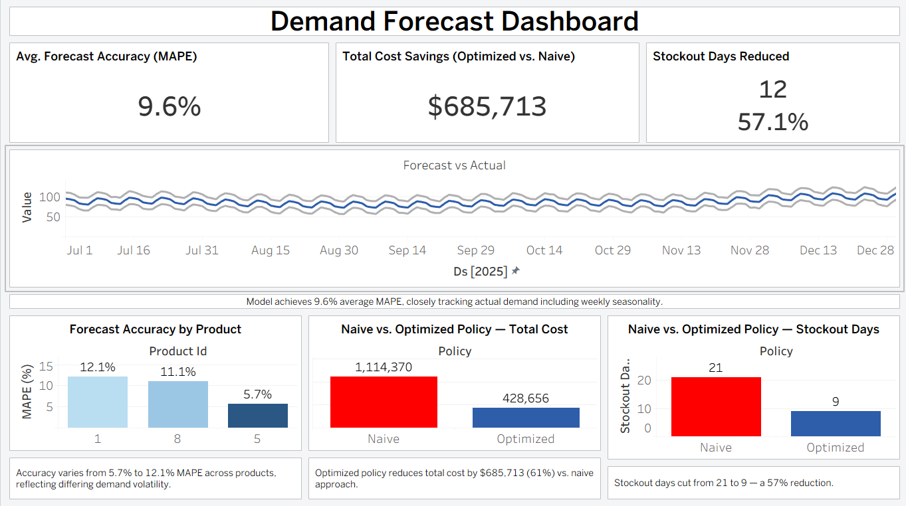

# Supply Chain Demand Forecasting & Inventory Optimization System (Phase 0)

Forecasting and inventory optimization pipeline for cross-border logistics operations — Python, Prophet, SQL, Streamlit

## Problem Statement (Phase 1)

A company managing product distribution across multiple warehouses — such as 
mining consumables or e-commerce goods moving between China and Africa — 
needs to forecast future demand accurately enough to avoid two costly failure 
modes: stockouts, which cause lost sales and operational disruption, and 
overstock, which ties up capital and increases holding costs. This project 
builds a forecasting and inventory optimization system that predicts product 
demand 30–90 days ahead and translates that forecast into concrete reorder 
recommendations, quantifying the cost trade-off between the two failure modes.

## Architecture

```
Synthetic Data (CSV)
        ↓
Exploratory Data Analysis (trend/seasonality decomposition)
        ↓
Forecasting Model (Prophet) → Evaluation (MAE/MAPE)
        ↓
Inventory Optimization Logic (safety stock, reorder point, cost simulation)
        ↓
   ┌────┴────┐
   ↓         ↓
Interactive          Tableau
Simulator            Dashboard
(Streamlit)          (static report)
```
## Tech Stack

- **Python** — data generation (Faker), forecasting, inventory optimization logic
- **Prophet** — time series forecasting (trend + seasonality decomposition)
- **statsmodels** — exploratory seasonal decomposition
- **scikit-learn** — forecast evaluation metrics (MAE, MAPE)
- **Streamlit** — interactive what-if simulator (live forecast + inventory recommendations)
- **Tableau Public** — static dashboard for forecast accuracy and cost comparison
- **Git/GitHub** — version control

## Core Deliverables (Phase 1)

1. **Demand forecast** — predicted units sold per product/warehouse (30/60/90 
   days ahead) with confidence intervals
2. **Inventory recommendation** — optimal reorder point and safety stock per 
   product/warehouse
3. **Cost impact analysis** — quantified comparison of current vs. optimized 
   inventory policy, measured in stockout days avoided and estimated cost savings

## Note on Synthetic Data (Phase 2)

Demand data is synthetically generated using trend, weekly and yearly 
seasonality components, random noise, and a small number of injected demand 
shocks, since real operational demand data is proprietary. This design 
ensures the dataset has genuine, detectable patterns for the forecasting 
model to learn, rather than being pure random noise.


## Exploratory Data Analysis (Phase 3)

Before modeling, the synthetic demand data was decomposed into trend, 
seasonal, and residual components using `statsmodels.tsa.seasonal_decompose`.


- **Trend:** Demand shows a clear upward trend, rising from roughly 65 to 
  100 units over the two-year period.
- **Seasonality:** A highly consistent weekly demand cycle is present, 
  confirming the intended weekly seasonality built into the synthetic data.
- **Residuals:** Residuals are mostly random noise centered around zero. 
  Note that because `seasonal_decompose` estimates trend via a rolling 
  average, the injected demand shocks partially influence the trend 
  component rather than appearing purely as residual outliers — a known 
  characteristic of this decomposition method.

  ## Forecasting Methodology (Phase 4)

Demand is forecasted using Facebook Prophet, configured with yearly and 
weekly seasonality enabled (matching the patterns confirmed during EDA) and 
daily seasonality disabled (not applicable to daily-granularity data).

Model evaluation uses a time-based train/test split (80/20) rather than 
random shuffling, since random splitting would leak future information into 
the training set — an invalid approach for time series data.


**Evaluation results across sample products:**

| Product | Warehouse | MAE | MAPE |
|---|---|---|---|
| 1 | 1 | 9.81 | 12.14% |
| 5 | 3 | 9.14 | 5.70% |
| 8 | 2 | 7.54 | 11.08% |

MAPE ranged from 5.7% to 12.1% across products, reflecting differing 
signal-to-noise ratios in demand patterns between products — products with 
stronger seasonal signal relative to noise (e.g., Product 5) forecast more 
accurately than those with more volatile demand (e.g., Product 1).

## Inventory Optimization

Using each product's forecasted demand volatility and lead time, safety 
stock and reorder points are calculated using standard inventory formulas:

- **Safety Stock** = Z(service level) × demand std. dev. × √(lead time)
- **Reorder Point** = (avg. daily demand × lead time) + safety stock
- **Economic Order Quantity (EOQ)** = √((2 × annual demand × order cost) / holding cost per unit)

A day-by-day simulation compares a naive policy (fixed reorder point, no 
safety stock buffer) against the optimized policy, tracking stockout days 
and total cost (holding cost + stockout cost) for each.


**Sample finding (Product 1, Warehouse 1, simulated over ~2 years):** the 
optimized, forecast-driven policy reduced total cost from $1,114,370 to 
$428,656 (a 61% reduction) while cutting stockout days from 21 to 9 (a 57% 
reduction) — demonstrating that a forecast-driven reorder policy meaningfully 
reduces both cost and stockout risk compared to a naive fixed-reorder approach.

**Assumptions:** demand is assumed approximately normally distributed for 
the safety stock calculation; stockout cost is modeled as 3× unit cost 
(representing lost sale + rush-order premium), and holding cost as 20% of 
unit cost annually, applied daily.

## Interactive Simulator

An interactive Streamlit app lets users select a product/warehouse, adjust 
target service level and lead time, and see live-updated demand forecasts, 
safety stock/reorder point recommendations, and a cost comparison against a 
naive inventory policy.


## Tableau Dashboard

A complementary Tableau dashboard presents forecast accuracy, inventory 
policy comparison, and cost savings in a static, shareable report format.



View the live interactive version: [Demand Forecast Dashboard](https://public.tableau.com/views/DemandForecastDashboard_17859000890550/DemandForecastDashboard?:language=en-US&publish=yes&:sid=&:redirect=auth&:display_count=n&:origin=viz_share_link)

## How to Run It

1. Clone the repo and install dependencies:
```bash
   pip install -r requirements.txt
```
2. Generate synthetic data:
```bash
   python forecasting/generate_data.py
```
3. Explore the data and model training process:
```bash
   jupyter notebook notebooks/exploration.ipynb
```
4. Launch the interactive simulator:
```bash
   streamlit run app/streamlit_app.py
```
5. View the Tableau dashboard: [Demand Forecast Dashboard](https://public.tableau.com/views/DemandForecastDashboard_17859000890550/DemandForecastDashboard?:language=en-US&publish=yes&:sid=&:redirect=auth&:display_count=n&:origin=viz_share_link)

## Note on Synthetic Data

Demand data is synthetically generated using trend, weekly and yearly 
seasonality components, random noise, and a small number of injected demand 
shocks, since real operational demand data is proprietary. This design 
ensures the dataset has genuine, detectable patterns for the forecasting 
model to learn, rather than being pure random noise.