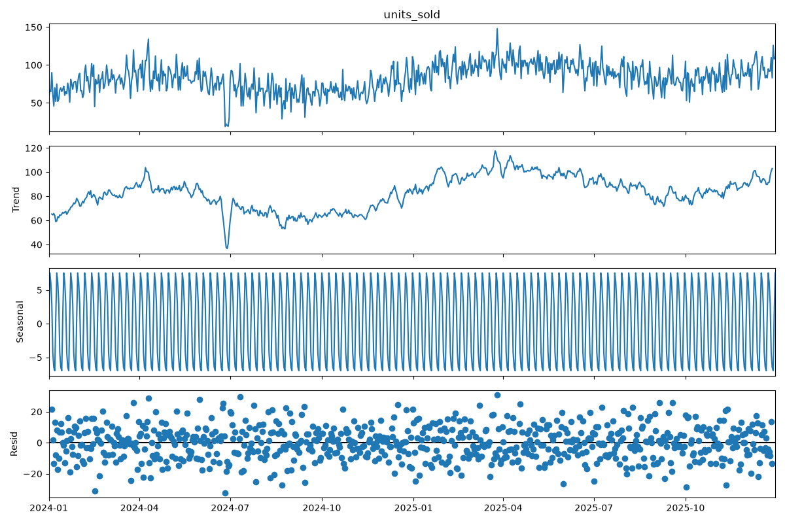

# Supply Chain Demand Forecasting & Inventory Optimization System

Forecasting and inventory optimization pipeline for cross-border logistics operations — Python, Prophet, SQL, Streamlit

## Problem Statement

A company managing product distribution across multiple warehouses — such as 
mining consumables or e-commerce goods moving between China and Africa — 
needs to forecast future demand accurately enough to avoid two costly failure 
modes: stockouts, which cause lost sales and operational disruption, and 
overstock, which ties up capital and increases holding costs. This project 
builds a forecasting and inventory optimization system that predicts product 
demand 30–90 days ahead and translates that forecast into concrete reorder 
recommendations, quantifying the cost trade-off between the two failure modes.

## Core Deliverables

1. **Demand forecast** — predicted units sold per product/warehouse (30/60/90 
   days ahead) with confidence intervals
2. **Inventory recommendation** — optimal reorder point and safety stock per 
   product/warehouse
3. **Cost impact analysis** — quantified comparison of current vs. optimized 
   inventory policy, measured in stockout days avoided and estimated cost savings

## Note on Synthetic Data

Demand data is synthetically generated using trend, weekly and yearly 
seasonality components, random noise, and a small number of injected demand 
shocks, since real operational demand data is proprietary. This design 
ensures the dataset has genuine, detectable patterns for the forecasting 
model to learn, rather than being pure random noise.

## Exploratory Data Analysis

Before modeling, the synthetic demand data was decomposed into trend, 
seasonal, and residual components using `statsmodels.tsa.seasonal_decompose`.

- **Trend:** Demand shows a clear upward trend, rising from roughly 65 to 
  100 units over the two-year period.
- **Seasonality:** A highly consistent weekly demand cycle is present, 
  confirming the intended weekly seasonality built into the synthetic data.
- **Residuals:** Residuals are mostly random noise centered around zero. 
  Note that because `seasonal_decompose` estimates trend via a rolling 
  average, the injected demand shocks partially influence the trend 
  component rather than appearing purely as residual outliers — a known 
  characteristic of this decomposition method.