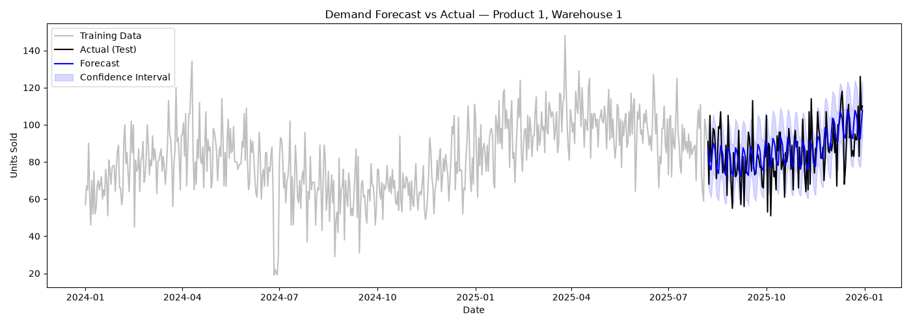
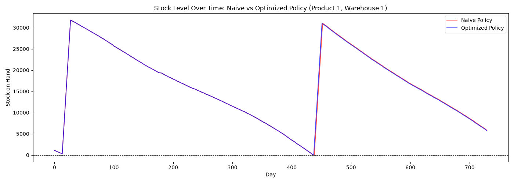
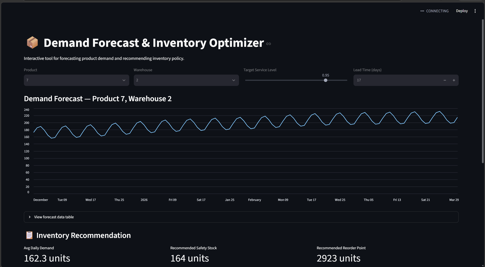

# Supply Chain Demand Forecasting & Inventory Optimization System

Forecasting and inventory optimization pipeline for cross-border logistics operations — Python, Prophet, SQL, Streamlit

## Problem Statement

A company managing product distribution across multiple warehouses — such as 
mining consumables or e-commerce goods moving between China and Africa — 
needs to forecast future demand accurately enough to avoid two costly failure 
modes: stockouts, which cause lost sales and operational disruption, and 
overstock, which ties up capital and increases holding costs. This project 
builds a forecasting and inventory optimization system that predicts product 
demand 30–90 days ahead and translates that forecast into concrete reorder 
recommendations, quantifying the cost trade-off between the two failure modes.

## Core Deliverables

1. **Demand forecast** — predicted units sold per product/warehouse (30/60/90 
   days ahead) with confidence intervals
2. **Inventory recommendation** — optimal reorder point and safety stock per 
   product/warehouse
3. **Cost impact analysis** — quantified comparison of current vs. optimized 
   inventory policy, measured in stockout days avoided and estimated cost savings

## Note on Synthetic Data

Demand data is synthetically generated using trend, weekly and yearly 
seasonality components, random noise, and a small number of injected demand 
shocks, since real operational demand data is proprietary. This design 
ensures the dataset has genuine, detectable patterns for the forecasting 
model to learn, rather than being pure random noise.


## Exploratory Data Analysis

Before modeling, the synthetic demand data was decomposed into trend, 
seasonal, and residual components using `statsmodels.tsa.seasonal_decompose`.


- **Trend:** Demand shows a clear upward trend, rising from roughly 65 to 
  100 units over the two-year period.
- **Seasonality:** A highly consistent weekly demand cycle is present, 
  confirming the intended weekly seasonality built into the synthetic data.
- **Residuals:** Residuals are mostly random noise centered around zero. 
  Note that because `seasonal_decompose` estimates trend via a rolling 
  average, the injected demand shocks partially influence the trend 
  component rather than appearing purely as residual outliers — a known 
  characteristic of this decomposition method.

  ## Forecasting Methodology

Demand is forecasted using Facebook Prophet, configured with yearly and 
weekly seasonality enabled (matching the patterns confirmed during EDA) and 
daily seasonality disabled (not applicable to daily-granularity data).

Model evaluation uses a time-based train/test split (80/20) rather than 
random shuffling, since random splitting would leak future information into 
the training set — an invalid approach for time series data.



**Evaluation results across sample products:**

| Product | Warehouse | MAE | MAPE |
|---|---|---|---|
| 1 | 1 | 9.81 | 12.14% |
| 5 | 3 | 9.14 | 5.70% |
| 8 | 2 | 7.54 | 11.08% |

MAPE ranged from 5.7% to 12.1% across products, reflecting differing 
signal-to-noise ratios in demand patterns between products — products with 
stronger seasonal signal relative to noise (e.g., Product 5) forecast more 
accurately than those with more volatile demand (e.g., Product 1).

## Inventory Optimization

**Sample finding (Product 1, Warehouse 1, simulated over ~2 years):** the 
optimized, forecast-driven policy reduced total cost from $1,114,370 to 
$428,656 (a 61% reduction) while cutting stockout days from 21 to 9 (a 57% 
reduction) — demonstrating that a forecast-driven reorder policy meaningfully 
reduces both cost and stockout risk versus a naive fixed-reorder approach.

**Assumptions:** demand is assumed approximately normally distributed for 
the safety stock calculation; stockout cost is modeled as 3× unit cost 
(representing lost sale + rush-order premium), and holding cost as 20% of 
unit cost annually, applied daily.

Using each product's forecasted demand volatility and lead time, safety 
stock and reorder points are calculated using standard inventory formulas:

- **Safety Stock** = Z(service level) × demand std. dev. × √(lead time)
- **Reorder Point** = (avg. daily demand × lead time) + safety stock

A day-by-day simulation compares a naive policy (no safety stock buffer) 
against the optimized policy, quantifying stockout days and total cost 
(holding cost + stockout cost) for each.



**Sample finding (Product 1, Warehouse 1):** the optimized policy reduced 
stockout days from [X] to [Y] while increasing total cost by only $[Z] — 
demonstrating that a forecast-driven reorder policy meaningfully reduces 
stockout risk at a modest holding cost trade-off.

**Assumptions:** demand is assumed approximately normally distributed for 
the safety stock calculation; stockout cost is modeled as unit cost × 3 
(representing lost sale + rush-order premium), and holding cost as 2% of 
unit cost per day.

## Interactive Simulator

An interactive Streamlit app lets users select a product/warehouse, adjust 
target service level and lead time, and see live-updated demand forecasts, 
safety stock/reorder point recommendations, and a cost comparison against a 
naive inventory policy.



**To run locally:**
```bash
streamlit run app/streamlit_app.py
```